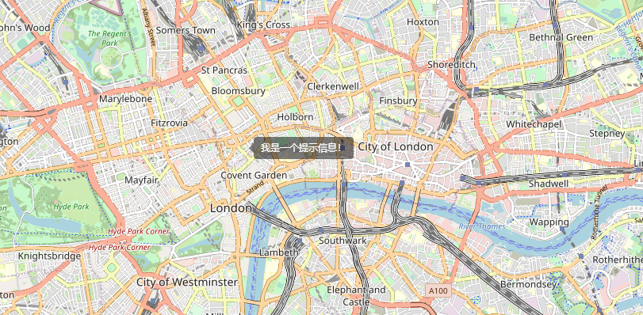

# leaflet-mousetips

leaflet-mousetips是一个简单的跟随鼠标提示信息控件，您可以将其放入地图中。当鼠标在地图上移动时，它会在鼠标右侧显示提示信息。[demo](http://examples.panzhiyue.website/leaflet/mousetips/index.html)

## 效果图



## 语法 

```javascript
var map = L.map('map',{
    mouseTipsControl:true,
    mouseTipsOptions:{
    show: true,
    message:'我是一个提示信息！'
}
}).setView([51.505, -0.09], 13);

或者

//创建鼠标提示控件
var mouseTips = L.control.mouseTips({
    show: true,
    message:'我是一个提示信息！'
}).addTo(map);
```

## 参数

`position:` 默认`topleft`,请不要修改它

`show:` 用于控制创建控件时是显示还是隐藏。

`message:` 要显示的提示信息

## 方法

| 名称            | 描述              |
| --------------- | ----------------- |
| setMessage(msg) | 设置提示信息      |
| getMessage()    | 获取提示信息      |
| show()          | 显示控件          |
| hide()          | 隐藏控件          |
| toggle()        | 切换显示/隐藏状态 |

